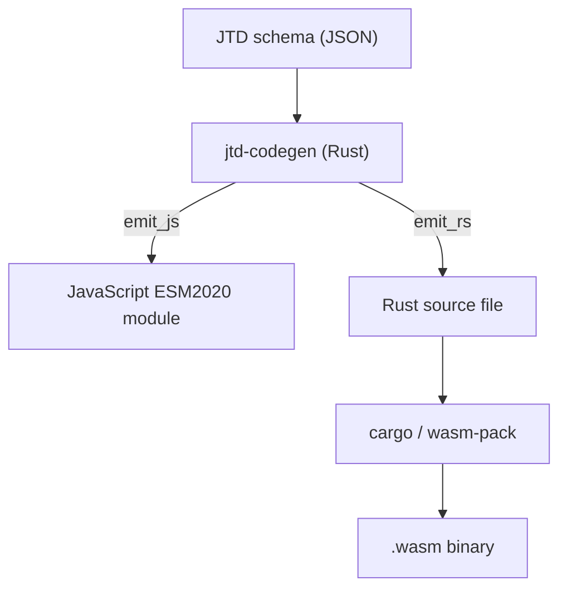

# jtd-wasm

Ahead-of-time code generator that compiles [RFC 8927 JSON Type Definition](https://www.rfc-editor.org/rfc/rfc8927)
schemas into optimised validation functions -- no interpreter, no AST at
runtime, no dead code.

## Supported Scenarios

| Scenario | Workflow | Use Case |
|----------|----------|----------|
| **Rust → Rust** | Schema → `.rs` source | Rust backend services needing high-performance validation |
| **Rust → WASM** | Schema → `.rs` → `wasm-pack` → `.wasm` | Browser apps needing native validation speed & type safety |
| **Rust → JavaScript** | Schema → `.mjs` module | Node.js/Browser apps where a standalone JS module is preferred |

The Rust target exists because JavaScript has a performance ceiling.
A JTD schema compiled to Rust, then compiled to WASM via `wasm-pack`,
produces a compact binary that validates JSON in the browser at native
speed.



There is no interpreter anywhere in this pipeline.  The generated code
contains exactly the checks the schema requires and nothing else.

## Specification

The code generator implements
[JTD_CODEGEN_SPEC.md](./JTD_CODEGEN_SPEC.md), a language-independent
specification for compiling JTD schemas into target-language source code.

This repository includes a corrected copy of the spec.  The upstream
version had incorrect schema paths in the Section 6.1 table, Section 5.2
code examples, and the Section 8 worked example.  The corrections were
validated against the authoritative
[`json-typedef-spec/tests/validation.json`](https://github.com/jsontypedef/json-typedef-spec)
test suite (316 test cases, all passing for both emitters).

## Quick start

### Interactive demo

Try the live validator playground:

```bash
xmake run demo
```

Then open http://localhost:8080/ in your browser.

The demo includes:
- Two example schemas (simple user, complex event with discriminators)
- Real-time validation with detailed error reporting
- Test case quick-load buttons
- Live schema display

See [examples/README.md](./examples/README.md) for details.

**Available xmake targets:**

```bash
xmake show -l targets              # List all targets

# Compatibility tests
xmake run fetch_suite              # Download official test suite
xmake run test_rust                # Run Rust validator tests (316 cases)
xmake run test_js                  # Run JS validator tests (316 cases)
xmake run test_wasm                # Run WASM validator tests (316 cases)
xmake run test_all                 # Run all tests

# Demo system
xmake run demo_build               # Build jtd-codegen release binary
xmake run demo_init                # Generate nginx.conf from template
xmake run demo_compile             # Compile example validators
xmake run demo_start               # Start nginx server
xmake run demo                     # Run all demo steps
```

### Development

Ensure all checks (fmt, clippy, tests) pass before committing:

```bash
# Verify everything (format, lint, unit tests, integration tests)
xmake run test_all

# Run code quality checks only
xmake run check

# Install git pre-commit hook to enforce quality automatically
xmake run install_hooks
```

### Generate a JavaScript validator

```rust
use jtd_codegen::{compiler, emit_js};

let schema = serde_json::from_str(r#"{
  "properties": {
    "name": { "type": "string" },
    "age":  { "type": "uint8" }
  }
}"#).unwrap();

let compiled = compiler::compile(&schema).unwrap();
let js_code = emit_js::emit(&compiled);
// js_code is a standalone ES module with `export function validate(instance)`
```

### Generate a Rust validator

```rust
use jtd_codegen::{compiler, emit_rs};

let schema = serde_json::from_str(r#"{
  "properties": {
    "name": { "type": "string" },
    "age":  { "type": "uint8" }
  }
}"#).unwrap();

let compiled = compiler::compile(&schema).unwrap();
let rs_code = emit_rs::emit(&compiled);
// rs_code is a standalone Rust module with `pub fn validate(instance: &Value) -> Vec<(String, String)>`
```

### Compile to WASM

The Rust emitter output is a `.rs` file that depends only on `serde_json`.
To turn it into a WASM module for the browser:

1. Generate the Rust source with `emit_rs::emit()`
2. Place it in a WASM crate that adds `wasm-bindgen` bindings
3. Build with `wasm-pack build --target web`

The `jtd-wasm-validator/` directory is an example of this pattern.

## Test results

Both emitters pass the complete official JTD validation test suite
(`json-typedef-spec/tests/validation.json`, 316 test cases).

This repo does not vendor the upstream suite. Use xmake to fetch a pinned
revision of `json-typedef-spec` into `.tmp/` and run compatibility tests.

```
xmake run fetch_suite
xmake run test_all
```

`test_wasm` builds the generated Rust validators to `wasm32-wasip1` and runs
them under `wasmtime`. If you run it directly, you may need:

```
rustup target add wasm32-wasip1
```

- **76 unit tests** covering AST, compiler, and individual emitter components
- **316 JS integration tests** (emit JS → run via embedded QuickJS → compare errors)
- **316 Rust integration tests** (emit Rust → compile temp crate → run → compare errors)

## Requirements

- Rust 1.70+
- [xmake](https://xmake.io/) (compatibility suite orchestration)
- `curl` (fetch upstream test suite)
- `wasmtime` (WASM runtime for compatibility tests)
- `wasm-pack` (for WASM compilation)

## Compatibility suite

Fetch the pinned upstream suite into `.tmp/` and run the compatibility tests:

```
xmake run fetch_suite
xmake run test_all
```

WASM tests compile a generated validator to WASI and run it with `wasmtime`.
If you run WASM tests directly, you may need:

```
rustup target add wasm32-wasip1
```
