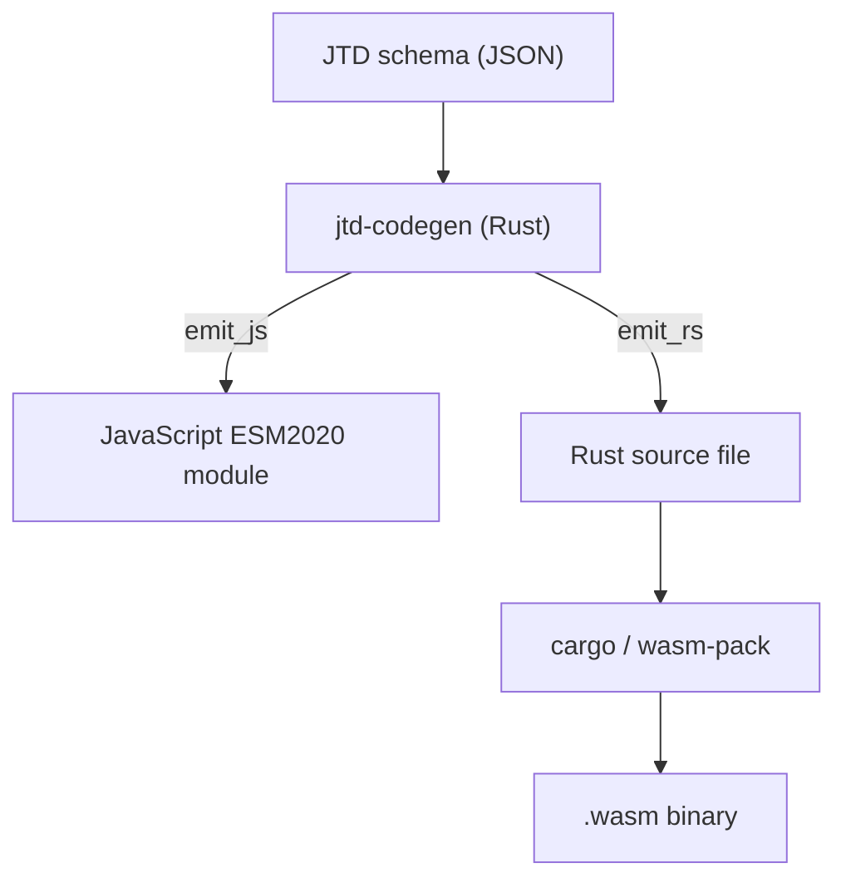

# jtd-wasm

[](https://github.com/simbo1905/jtd-wasm/actions/workflows/ci.yml)
[](https://github.com/simbo1905/jtd-wasm/releases)
[](LICENSE)

**Ahead-of-time code generator for [RFC 8927 JSON Type Definition](https://www.rfc-editor.org/rfc/rfc8927).**

Compiles JTD schemas into optimized validation functions for Rust and JavaScript. No interpreter, no AST at runtime, zero overhead.

## 🚀 Interactive Demo

**[Try the Live Playground](https://simbo1905.github.io/jtd-wasm/)**

Test schemas against the generated validators (JS and WASM) directly in your browser.



## ✨ Features

- **Zero Runtime Overhead**: Generates efficient code that performs validation directly. No schema parsing or interpretation at runtime.
- **Multi-Target**:
  - **JavaScript**: Generates standalone ESM `.mjs` files. No dependencies.
  - **Lua**: Generates portable Lua 5.1 / LuaJIT code.
  - **Rust**: Generates struct-free, dependency-light code (only `serde_json`).
  - **WebAssembly**: Combine Rust output with `wasm-pack` for native-speed browser validation.
- **Standard Compliant**: Verified against the [official JSON Type Definition compliance suite](https://github.com/jsontypedef/json-typedef-spec) (316 tests).
- **Safe & Secure**: Generated code uses finite recursion depth and explicit checks.

## 📦 Installation

### Pre-built Binaries
Download the latest release for macOS, Linux, or Windows from [GitHub Releases](https://github.com/simbo1905/jtd-wasm/releases).

### From Source
```bash
cargo install --git https://github.com/simbo1905/jtd-wasm jtd-codegen
```

## 🛠️ Usage

### CLI
Generate a validator from a schema file:

```bash
# Generate JavaScript
jtd-codegen --target js schema.json > validator.js

# Generate Lua
jtd-codegen --target lua schema.json > validator.lua

# Generate Rust
jtd-codegen --target rust schema.json > validator.rs
```

### Supported Workflows

| Scenario | Workflow | Use Case |
|----------|----------|----------|
| **Rust → Rust** | Schema → `.rs` | Rust backend services needing high-performance validation. |
| **Rust → WASM** | Schema → `.rs` → `.wasm` | Browser apps needing native speed & type safety. |
| **Rust → JavaScript** | Schema → `.mjs` | Node.js/Browser apps where a standalone, readable JS module is preferred. |
| **Rust → Lua** | Schema → `.lua` | Embedded systems (Nginx, Redis, Games) using Lua 5.1 or LuaJIT. |

### Code Examples

**JavaScript (ES Modules)**
```javascript
import { validate } from './validator.js';

const data = JSON.parse('{"name": "Alice", "age": 30}');
const errors = validate(data);

if (errors.length > 0) {
  console.error('Validation failed:', errors);
}
```

**Rust**
```rust
use serde_json::Value;
// Include the generated code
include!("validator.rs");

fn main() {
    let data: Value = serde_json::from_str(r#"{"name": "Alice"}"#).unwrap();
    let errors = validate(&data);
    
    if !errors.is_empty() {
        println!("Validation failed: {:?}", errors);
    }
}
```

**Lua (5.1 / LuaJIT)**
```lua
local validate = require("validator").validate

-- Assuming you have a JSON decoder (e.g., dkjson, cjson)
local data = { name = "Alice", age = 30 }
local errors = validate(data)

if #errors > 0 then
  for _, err in ipairs(errors) do
    print("Error at " .. err[1] .. ": " .. err[2])
  end
end
```

## 🧪 Development & Testing

This project uses `xmake` to orchestrate tests and cross-language verification.

```bash
# Run full verification (Format + Clippy + Rust/JS/WASM Tests)
xmake run test_all

# Run code quality checks only
xmake run check

# Install git pre-commit hook
xmake run install_hooks
```

## 📄 Specification

The code generator implements [JTD_CODEGEN_SPEC.md](./JTD_CODEGEN_SPEC.md). This repository includes a corrected copy of the upstream spec, validated against the official test suite.

## ⚖️ License

MIT / Apache-2.0
